# Explaining the Past

## Data Science
Data Science (a.k.a. Data Mining) is about explaining the past and predicting the future by means of data analysis.  Data science is a multi-disciplinary field which combines statistics, machine learning, artificial intelligence and database technology. The value of data science applications is often estimated to be very high. Many businesses have stored large amounts of data over years of operation, and data science is able to extract very valuable knowledge from this data. The businesses are then able to leverage the extracted knowledge into more clients, more sales, and greater profits. This is also true in the engineering and medical fields.	

* Statistics		

The science of collecting, classifying, summarizing, organizing, analyzing, and interpreting data.		
 		
* Artificial Intelligence		

The study of computer algorithms dealing with the simulation of intelligent behaviors in order to perform those activities that are normally thought to require intelligence.		
 		
* Machine Learning		

The study of computer algorithms to learn in order to improve automatically through experience.		
 		
* Database 		

The science and technology of collecting, storing and managing data so users can retrieve, add, update or remove such data.		
 		
* Data warehousing		

The science and technology of collecting, storing and managing data with advanced multi-dimensional reporting services in support of the decision making processes.
	

### Univariate Analysis
Univariate analysis explores variables (attributes) one by one. Variables could be either categorical or numerical. There are different statistical and visualization techniques of investigation for each type of variable. 

Numerical variables can be transformed into categorical counterparts by a process called binning or discretization. It is also possible to transform a categorical variable into its numerical counterpart by a process called encoding. 

Finally, proper handling of missing values is an important issue in mining data.

#### Categorical Variables
A categorical or discrete variable is one that has two or more categories (values).  
There are two types of categorical variable, nominal and ordinal. 
A nominal variable has no intrinsic ordering to its categories. 
For example, gender is a categorical variable having two categories (male and female) with no intrinsic ordering to the categories. 
An ordinal variable has a clear ordering. For example, temperature as a variable with three orderly categories (low, medium and high).
A frequency table is a way of counting how often each category of the variable in question occurs. It may be enhanced by the addition of percentages that fall into each category.	

| Statistics 	| Visualization 	| Description                                          	|
|------------	|---------------	|------------------------------------------------------	|
| Count      	| Bar Chart     	|  The number of values of the specified variable.     	|
| Count %      	| Pie Chart     	|  The percentage of values of the specified variable. 	|

Example: The housing variable with three categories (for free, own and rent).	

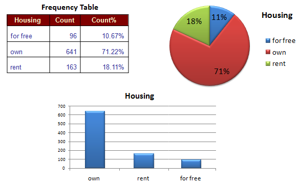

#### Numerical Variables

A numerical or continuous variable (attribute) is one that may take on any value within a finite or infinite interval (e.g., height, weight, temperature, blood glucose, ...). 
There are two types of numerical variables, interval and ratio. An interval variable has values whose differences are interpretable, but it does not have a true zero.
A good example is temperature in Centigrade degrees. Data on an interval scale can be added and subtracted but cannot be meaningfully multiplied or divided. 
For example, we cannot say that one day is twice as hot as another day. In contrast, a ratio variable has values with a true zero and can be added, subtracted, multiplied or divided (e.g., weight).	

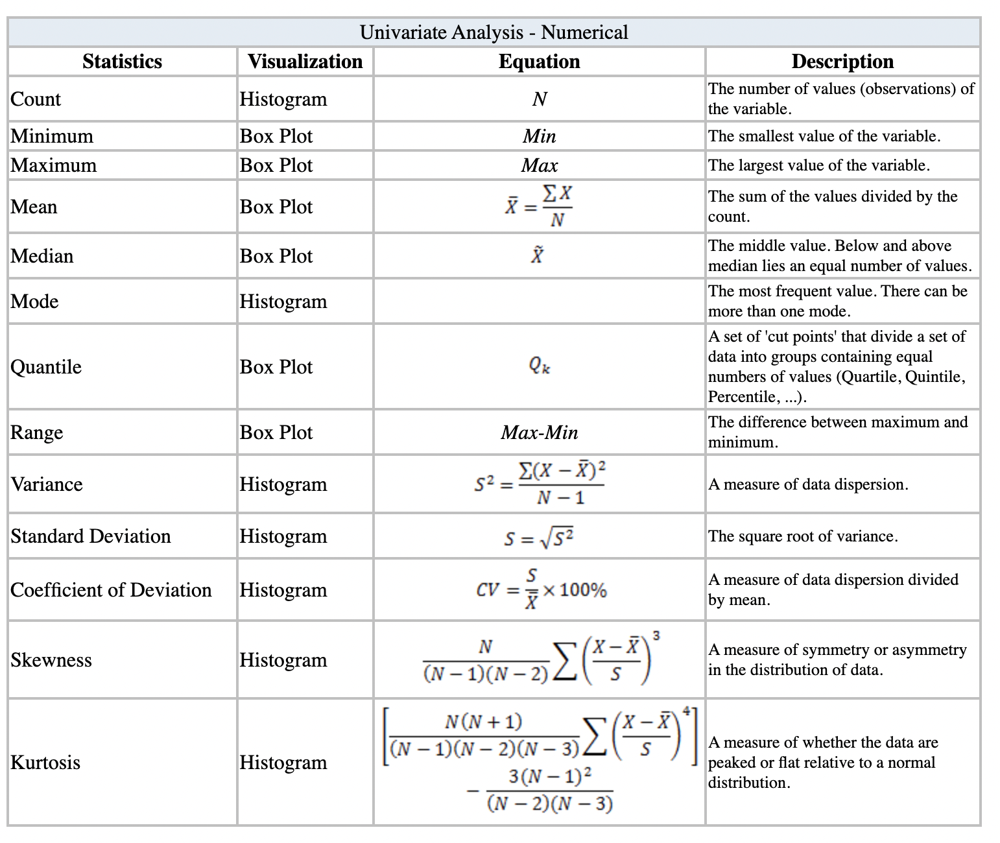

#### Binning
Binning or discretization is the process of transforming numerical variables into categorical counterparts. An example is to bin values for Age into categories such as 20-39, 40-59, and 60-79. Numerical variables are usually discretized in the modeling methods based on frequency tables (e.g., decision trees). Moreover, binning may improve accuracy of the predictive models by reducing the noise or non-linearity. Finally, binning allows easy identification of outliers, invalid and missing values of numerical variables.
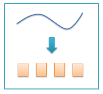

There are two types of binning, unsupervised and supervised.	

##### supervised 

##### unsupervised

#### Encoding
Encoding or continuization is the transformation of categorical variables to binary or numerical counterparts. An example is to treat male or female for gender as 1 or 0. Categorical variables must be encoded in many modeling methods (e.g., linear regression, SVM, neural networks). Two main types of encoding are Binary and Target-based.		
 		

  		
##### Binary Encoding
Numerization of categorical variables by taking the values 0 or 1 to indicate the absence or presence of each category. If the categorical variable has k categories we would need to create k binary variables (technically speaking, k-1 would suffice). In the following example, the categorical variable "Trend" with three values transformed to three separate binary numerical variables. The main drawback with this method is when the categorical variable with many values (e.g., city) which can tremendously increase the dimension of data. 

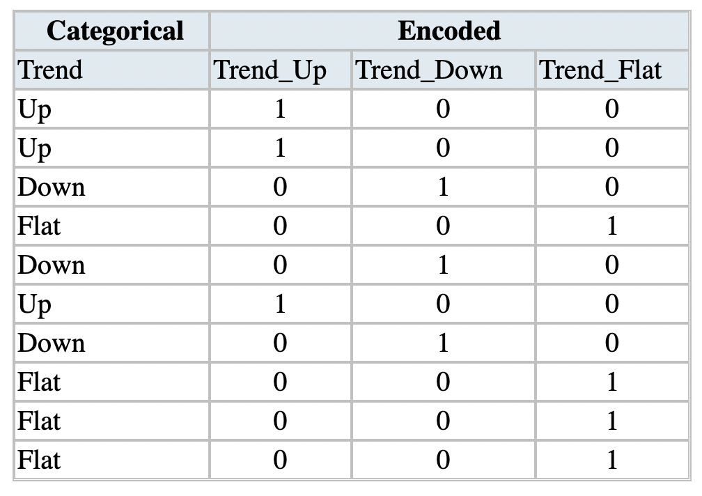

##### Target-based Encoding
Target-based encoding is numerization of categorical variables via target. In this method, we replace the categorical variable with just one new numerical variable and replace each category of the categorical variable with its corresponding probability of the target (if categorical) or average of the target (if numerical). The main drawbacks of this method are its dependency to the distribution of the target, and its lower predictability power compare to the binary encoding method.		
 		
Example 1:		
An example of target-based encoding via a categorical target.

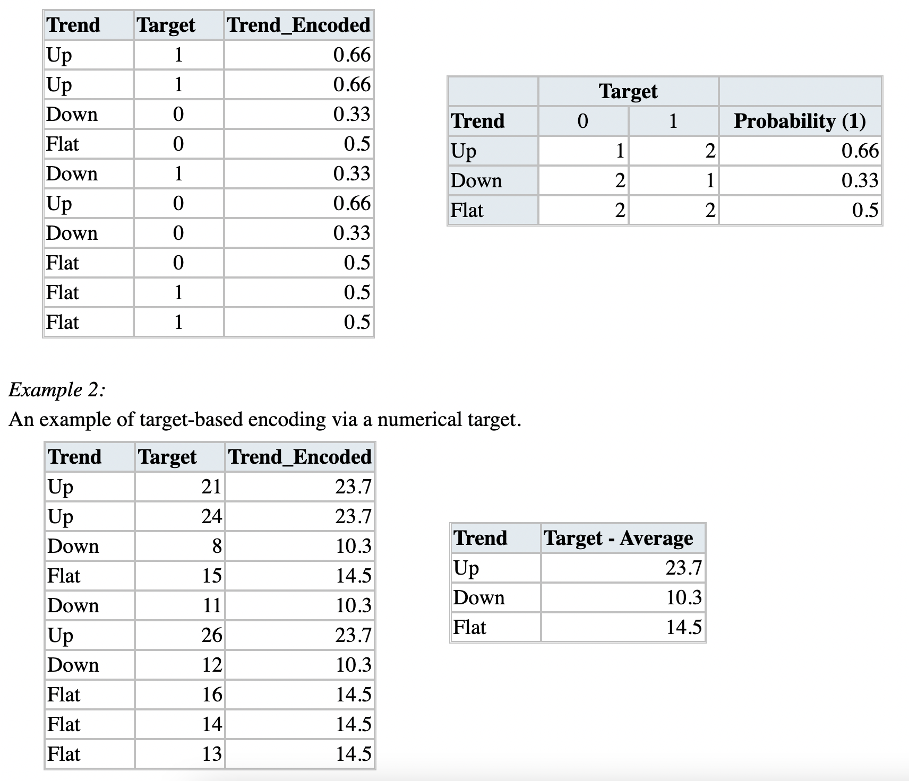

#### Missing value

Missing values are a common occurrence, and you need to have a strategy for treating them. A missing value can signify a number of different things in your data. Perhaps the data was not available or not applicable or the event did not happen. It could be that the person who entered the data did not know the right value, or missed filling in. Data mining methods vary in the way they treat missing values. Typically, they ignore the missing values, or exclude any records containing missing values, or replace missing values with the mean, or infer missing values from existing values.		
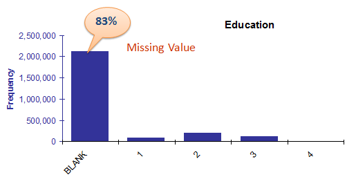

Missing Values Replacement Policies:		
* Ignore the records with missing values.
* Replace them with a global constant (e.g., “?”).
* Fill in missing values manually based on your domain knowledge.
* Replace them with the variable mean (if numerical) or the most frequent value (if categorical).
* Use modeling techniques such as nearest neighbors, Bayes’ rule, decision tree, or EM algorithm.

### Bivariate Analysis
Bivariate analysis is the simultaneous analysis of two variables (attributes). It explores the concept of relationship between two variables, whether there exists an association and the strength of this association, or whether there are differences between two variables and the significance of these differences. There are three types of bivariate analysis.		
 		
#### Numerical & Numerical

##### Scatter Plot
A scatter plot is a useful visual representation of the relationship between two numerical variables (attributes) and is usually drawn before working out a linear correlation or fitting a regression line. The resulting pattern indicates the type (linear or non-linear) and strength of the relationship between two variables. More information can be added to a two-dimensional scatter plot, for example, we might label points with a code to indicate the level of a third variable. If we are dealing with many variables in a data set, a way of presenting all possible scatter plots of two variables at a time is in a scatter plot matrix.

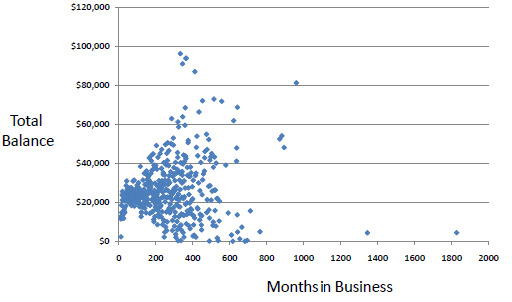

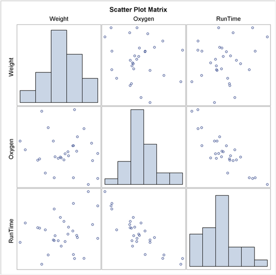
##### Linear Correlation
Linear correlation quantifies the strength of a linear relationship between two numerical variables. When there is no correlation between two variables, there is no tendency for the values of one quantity to increase or decrease with the values of the second quantity.		

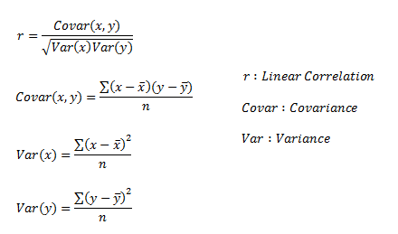

r only measures the strength of a linear relationship and is always between -1 and 1 where -1 means perfect negative linear correlation and +1 means perfect positive linear correlation and zero means no linear correlation.

#### Categorical & Categorical

##### Chi-square Test
The chi-square test can be used to determine the association between categorical variables. It is based on the difference between the expected frequencies (e) and the observed frequencies (n) in one or more categories in the frequency table. The chi-square distribution returns a probability for the computed chi-square and the degree of freedom. A probability of zero shows a complete dependency between two categorical variables and a probability of one means that two categorical variables are completely independent. Tchouproff Contingency Coefficient measures the amount of dependency between two categorical variables.		

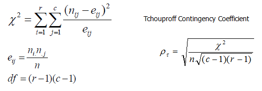

Example:		

The following frequency table (contingency table) with a chi-square of 10.67, degree of freedom (df) of 2 and probability of 0.005 shows a significant dependency between two categorical variables (hair and eye colors).

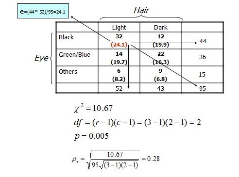

#### Numerical & Categorical

\newpage
# Explaining the Future

Predictive modeling is the process by which a model is created to predict an outcome. If the outcome is categorical it is called classification and if the outcome is numerical it is called regression.  Descriptive modeling or clustering is the assignment of observations into clusters so that observations in the same cluster are similar. Finally, association rules can find interesting associations amongst observations.	

\newpage

# Website link

 <https://www.saedsayad.com/data_mining_map.htm>
 
 
